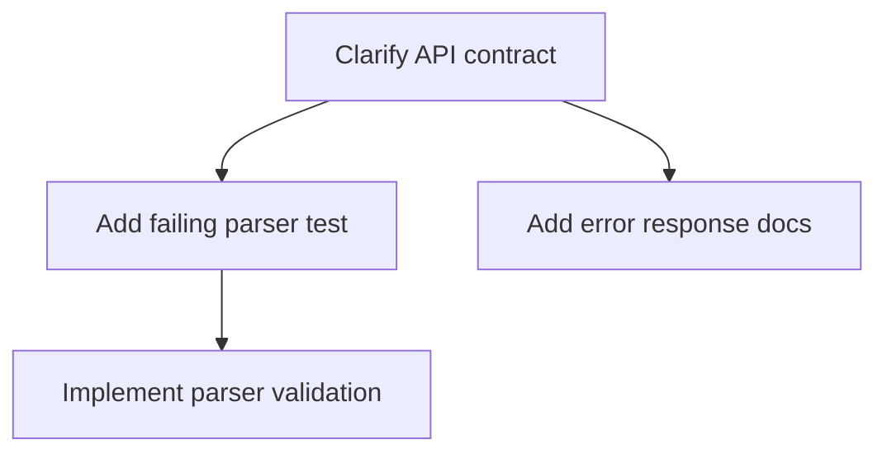

# Execution Plan

## Overview

High-level description of objectives, scope, and key considerations.

## Task List

All tasks with complete definitions, each task must use the following shape:

```markdown
### `<id>`: `<label>`
- goal: `<goal>`
- type: `<task type>`
- inputs: `<input description>`
- outputs: `<expected output>`
- verification: `<how to verify the output is correct>`
- checkpoints:
  1. `<criteria to be met>`
- steps:
  1. `<action to be taken>`
- depends-on: none | `<task ids>`
```

## Task DAG

Directed acyclic graph representing task dependencies and execution order:



## Execution Waves

groups of tasks that can be executed within the same phase. MUST be marked with `#parallel` when multiple tasks can run concurrently:

```markdown
- `<wave number>`(`<task ids>`): `<a clear description of the wave’s purpose and scope>` [#parallel]
```

## Checkpoints

Plan-level checkpoints between waves for progress tracking and safe execution transitions:

```markdown
- `<checkpoint id>`: after `<wave number>`, `<criteria to be met>`
```

## Trackable TO-DO List

Tracking only; this checklist does not define execution order. Tasks within the same wave execute concurrently:

```markdown
- `<wave number>` #parallel
  - [ ] `<task id1>`: `<action required to complete>`
  - [ ] `<task id2>`: `<action required to complete>`
- checkpoints after `<wave number>`
  - [ ] `<checkpoint id1>`: `<criteria to be met>`
  - [ ] `<checkpoint id2>`: `<criteria to be met>`
```
