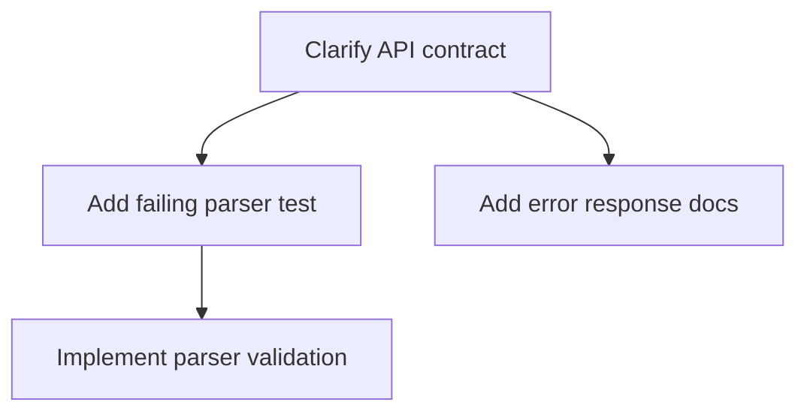

# Execution Plan

## Overview

<!-- high-level description of objectives, scope, and key considerations -->

## Task List

<!-- All tasks with complete definitions, each task must use the following shape -->

**`<id>`: `<label>`**

- goal: `<goal>`
- type: `<task type>`
- inputs: `<input description>`
- outputs: `<expected output>`
- verification: `<how to verify the output is correct>`
- checkpoints:
  1. `<criteria to be met>`
- steps:
  1. `<action to be taken>`
- depends-on: none | `<task ids>`

## Task DAG

<!-- Directed acyclic graph representing task dependencies and execution order -->

## Execution Waves

<!-- Groups of tasks that can be executed together in the same phase, marked with parallel when they can be run concurrently. -->

- `<wave number>`(`<task ids>`): `<a clear description of the wave’s purpose and scope>` [#parallel]  

## Checkpoints

<!-- Plan-level checkpoints between task groups for progress tracking and safe execution transitions -->

- `<checkpoint id>`: after `<task ids>`, `<criteria to be met>`

## Trackable TO-DO List

<!-- Tracking only; this checklist does not define execution order. Tasks within the same wave execute concurrently. -->

- `<wave number>` #parallel
  - [ ] `<task id>`: `<action required to complete>`
  - [ ] `<task id>`: `<action required to complete>`

- Checkpoints
  - [ ] `<checkpoint id>`: `<criteria to be met>`
